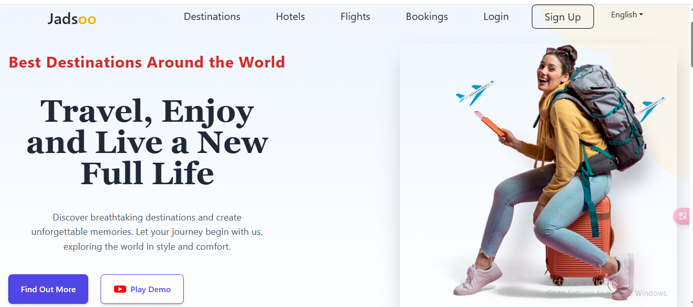

# Travel Website

This is a travel website built using **React.js**, **TypeScript**, **Tailwind CSS**, and **Framer Motion**. The website showcases various travel destinations and offers an interactive experience with animations and smooth transitions.

## Features

- **React.js & TypeScript** for building dynamic components and ensuring type safety.
- **Tailwind CSS** for utility-first styling, making it responsive and easy to customize.
- **Framer Motion** for adding smooth animations, including opacity transitions and other effects.

## 🎬 Demo Video Google Drive

👉 [Click here to watch the demo video on Google Drive](https://drive.google.com/file/d/1ChJRZaQ9A0hB7KjuNuXsYcrFuhMOfZsK/view)


## Live Link

Check out the Live version of the website [here](https://travels97.netlify.app/).

## Screenshots



## Screenshots 2


## Screenshots 3


## Screenshots 4


## Installation

To run this project locally, follow the steps below:

1. Clone the repository:
   ```bash
   git clone https://github.com/mahfujalarony/Travel.git
   npm install
   npm start


